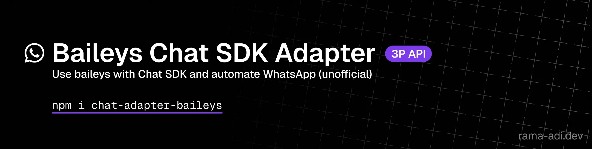

<div align="center">



<p>
  <a href="https://rama-adi.dev/projects/chat-adapter-baileys">🏠 Homepage</a>
  &nbsp;•&nbsp;
  <a href="https://rama-adi.dev/docs/chat-adapter-baileys/">📚 Docs</a>
</p>

</div>

# chat-adapter-baileys

WhatsApp (Baileys) adapter for the [Chat SDK](https://www.npmjs.com/package/chat). Run Chat SDK bots on WhatsApp — connection, message parsing, formatting, media, reactions, and typing indicators included.

> [!WARNING]
> Baileys is an unofficial WhatsApp Web API, not an official WhatsApp/Meta API. It may break when WhatsApp changes its protocol, and WhatsApp may ban numbers using unofficial automation. Use at your own risk.

## Install

```bash
pnpm add chat-adapter-baileys baileys chat @chat-adapter/state-memory
```

## Quick Start

```ts
import { Chat } from "chat";
import { createMemoryState } from "@chat-adapter/state-memory";
import { useMultiFileAuthState } from "baileys";
import { createBaileysAdapter } from "chat-adapter-baileys";

const { state, saveCreds } = await useMultiFileAuthState("./auth_info");

const whatsapp = createBaileysAdapter({
  auth: { state, saveCreds },
  userName: "my-bot",
  onQR: (qr) => console.log(qr), // scan with WhatsApp → Linked Devices
});

const bot = new Chat({
  userName: "my-bot",
  adapters: { whatsapp },
  state: createMemoryState(),
});

// Register handlers BEFORE connecting — messages arrive as soon as connect() runs
bot.onNewMention(async (thread, message) => {
  await thread.post(`Hello ${message.author.userName}!`);
  await thread.subscribe();
});

bot.onSubscribedMessage(async (thread, message) => {
  if (message.author.isMe) return;
  await thread.post(`You said: ${message.text}`);
});

await bot.initialize();
await whatsapp.connect();
```

Credentials are saved to `./auth_info` on first login and reused on later startups — no QR rescan needed.

## Documentation

Full docs are hosted at **[rama-adi.dev/docs/chat-adapter-baileys](https://rama-adi.dev/docs/chat-adapter-baileys/v2/quickstart)** (source in [`docs/`](./docs)):

- [Quickstart](https://rama-adi.dev/docs/chat-adapter-baileys/v2/quickstart) — step-by-step setup
- [Runnable Example](https://rama-adi.dev/docs/chat-adapter-baileys/v2/example) — full working bot
- [Concepts](https://rama-adi.dev/docs/chat-adapter-baileys/v2/concepts) — how Chat SDK maps to WhatsApp
- [Events & Lifecycle](https://rama-adi.dev/docs/chat-adapter-baileys/v2/events-and-lifecycle) — auth, connect, reconnect
- [Thread IDs & Multi-Account](https://rama-adi.dev/docs/chat-adapter-baileys/v2/thread-ids-and-multi-account)
- [Formatting & Media](https://rama-adi.dev/docs/chat-adapter-baileys/v2/formatting-and-media)
- [Extensions](https://rama-adi.dev/docs/chat-adapter-baileys/v2/extensions) — WhatsApp-specific features
- [Error Handling](https://rama-adi.dev/docs/chat-adapter-baileys/v2/error-handling)
- [Migration: v1 → v2](https://rama-adi.dev/docs/chat-adapter-baileys/v2/migration)
- [v1 Docs (archived)](https://rama-adi.dev/docs/chat-adapter-baileys/v1)

## Support Overview

### Chat SDK Base

| Feature | Support |
|---|---|
| Post message | ✅ |
| Edit message | ✅ |
| Delete message | ✅ |
| Add reactions | ✅ |
| Remove reactions | ✅ |
| Observe reactions | ✅ |
| Typing indicator | ✅ |
| DMs | ✅ |
| Fetch thread info | ✅ |
| Fetch channel info | ✅ |
| Post channel message | ✅ |
| Fetch messages | ⚠️ Returns empty unless you persist your own history |
| Fetch single message | ❌ |
| Fetch channel messages | ⚠️ Returns empty unless you persist your own history |
| List threads | ❌ |
| Streaming | ❌ |
| Scheduled messages | ❌ |
| Slash commands | ❌ |
| Modals | ❌ |
| Ephemeral messages | ❌ |

### Baileys Extras

WhatsApp-specific methods on the concrete adapter — see [Extensions](https://rama-adi.dev/docs/chat-adapter-baileys/v2/extensions).

| Method | Description |
|---|---|
| `reply(message, text)` | Send a quoted reply (native WhatsApp reply bubble) |
| `markRead({ threadId, messageIds, participant? })` | Send read receipts (blue double-ticks) |
| `setPresence("available" \| "unavailable")` | Set bot's global online/offline status |
| `sendLocation({ threadId, latitude, longitude, name?, address? })` | Send a native location pin |
| `sendPoll({ threadId, question, options, selectableCount?, metadata? })` | Send a WhatsApp poll |
| `fetchGroupParticipants(threadId)` | List group members with admin roles |

## Development

```bash
pnpm typecheck
pnpm test
pnpm build
```

## License

MIT
